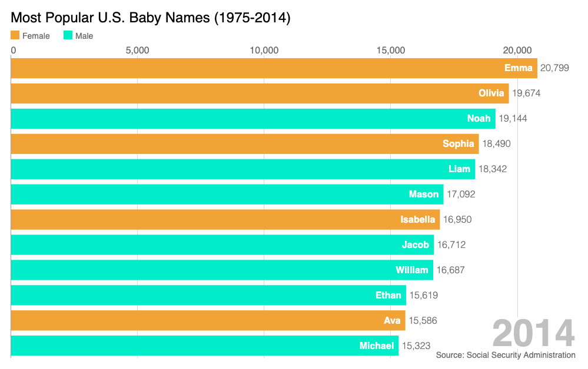

# Racing Bar Chart for Most Popular U.S. Baby Bames

Inspired by [Data is Beautiful](https://www.youtube.com/watch?v=2Uj1A9AguFs), this project uses [D3.js](https://d3js.org/) and followed closely an example from [Joel Zief](https://bl.ocks.org/jrzief/70f1f8a5d066a286da3a1e699823470f). Data comes from a Kaggle [repo](https://www.kaggle.com/kaggle/us-baby-names) sourced from U.S. Social Security ADministration and R script is used to below to prep data.

